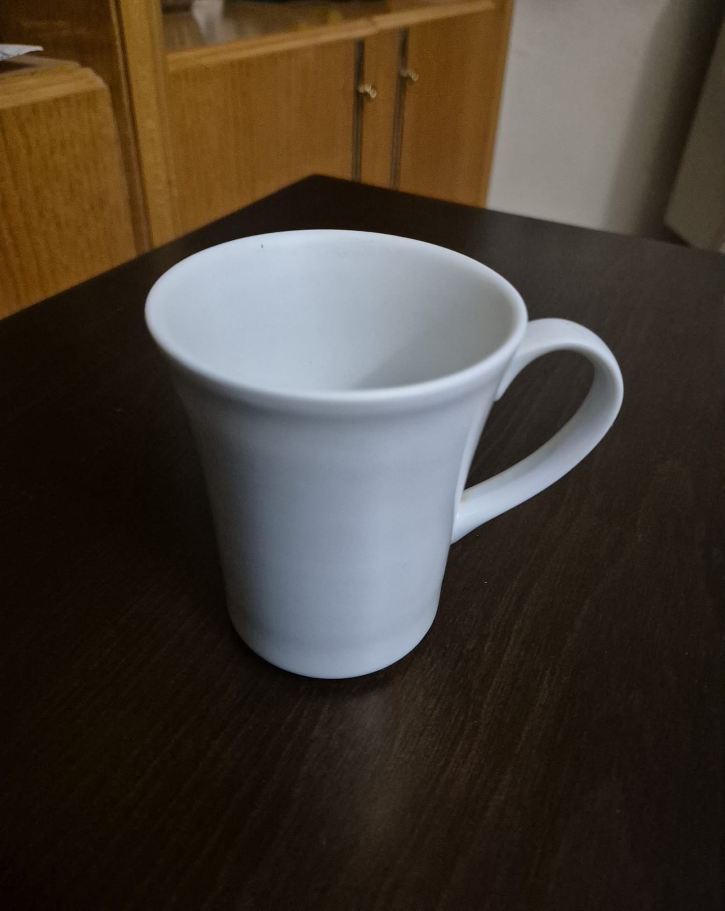
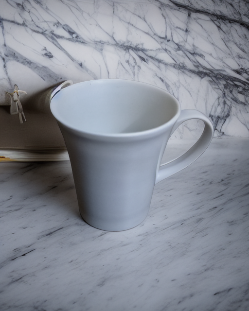
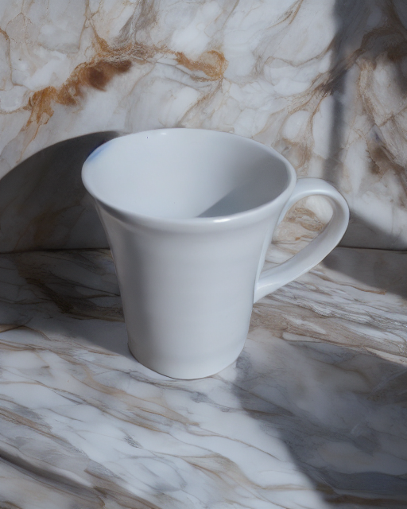
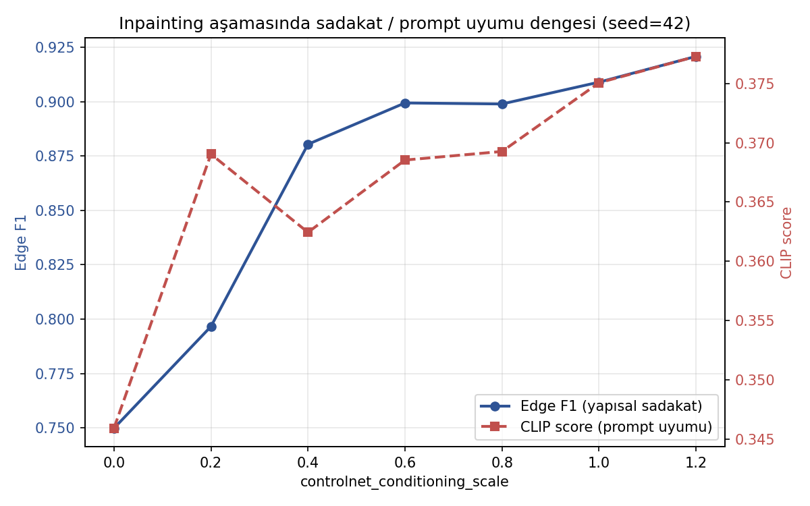
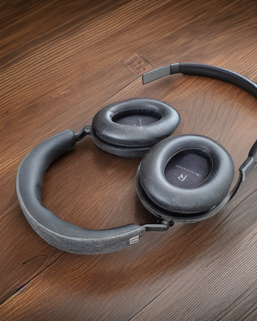
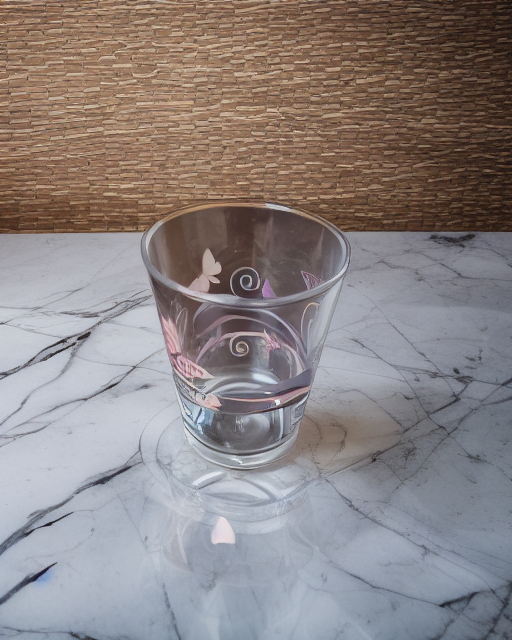

# Product Background Replacement Pipeline

Replace the background of an ordinary product photo without touching the product,
then relight the result so the object and the new scene share a single light source.

Built around Stable Diffusion 1.5, ControlNet, rembg/SAM and IC-Light, and evaluated
with structural-fidelity and prompt-adherence metrics rather than by eye.


---

## Why three stages

A naive ControlNet text-to-image pass gets the geometry right and the identity wrong.
In the very first experiment the model preserved the mug's silhouette but invented a
gold rim that does not exist on the real object, and kept the original photo's shading
while placing it in a new scene. Those two failures define the pipeline:

| Stage | Tool | Problem it solves |
|---|---|---|
| 1. Segmentation | rembg (u2net) | Which pixels are the product |
| 2. Inpainting | SD 1.5 inpainting + canny ControlNet | Identity: product pixels are copied, not generated |
| 3. Relighting | IC-Light (fc) | Lighting: object and scene get one consistent light source |

```
input photo ──► rembg mask ──► invert + erode 7px + feather 21px ──┐
       │                                                           │
       └──► canny (blur 5, thresholds 20/60) ──► crop to product ──┤
                                                                   ▼
                                          SD 1.5 inpainting + ControlNet (scale 0.6)
                                                                   │
                                                                   ▼
                                    IC-Light hybrid relighting (strength 0.7)
                                                                   │
                                                                   ▼
                                                            final image
```

---

## Results

| Original | Stage 2 (background replaced) | Stage 3 (relit) |
|---|---|---|
|  |  |  |

The gold rim is gone because stage 2 never generates the product. The shadow on the
wall and the warm cast on the counter come from stage 3, which recomputes lighting for
the whole frame instead of pasting a differently-lit object into a scene.

---

## Measurements

### Structural fidelity and prompt adherence vs ControlNet scale



Edge F1 climbs from **0.750** with no ControlNet to **0.899** at scale 0.6, then
plateaus — additional conditioning strength costs compute and buys nothing. CLIP score
rises slightly across the range because the canny map is cropped to the product, so the
background is never constrained. Working value: **0.6**.

### Stage comparison

| | Edge F1 | Precision | Recall | CLIP (scene) | CLIP (light) |
|---|---|---|---|---|---|
| Stage 2 | 0.8999 | 0.8889 | 0.9112 | 0.3554 | 0.2103 |
| Stage 3 | 0.8151 | 0.8057 | 0.8248 | 0.3675 | 0.2237 |

Stage 3 trades ~0.085 of edge fidelity for lighting control. Part of that drop is the
metric's own blind spot: canny cannot distinguish an object boundary from a shading
boundary, so relighting registers as lost fidelity. Precision sits below recall in both
stages, meaning the pipeline invents more edges than it erases.

### Segmentation ablation

Five products, four difficulty classes, same table and lighting.

| Product | Class | IoU (rembg vs SAM) | Area rembg | Area SAM | Verdict |
|---|---|---|---|---|---|
| Mug | matte | 0.9874 | 19.8% | 19.5% | interchangeable |
| Book | matte | 0.9926 | 14.3% | 14.2% | interchangeable |
| Fork | thin detail | 0.9266 | 2.4% | 2.4% | SAM resolves the tines |
| Glass | transparent | 0.9919 | 12.7% | 12.6% | both solid — fine for inpainting |
| Headphones | low contrast | 0.2318 | 28.8% | 6.7% | **both inadequate** |

Three things this table taught, none of which the IoU column says on its own:

- **IoU is size-sensitive.** The fork's 0.9266 comes from a 2.4% area, where a one-pixel
  edge disagreement moves the number a lot.
- **High IoU is not correctness.** On the glass both methods agree at 0.99 *and* both
  produce a solid mask that ignores transparency. That is the right answer for
  inpainting (the optics behind glass cannot be regenerated anyway) and the wrong answer
  for compositing. "Correct mask" is task-dependent.
- **Prompts are hyperparameters.** SAM's box prompt captured only the headband
  (6.7% area, confidence 0.834); adding two positive points on the ear cups recovered
  them, though the edges stayed ragged.

Default: rembg. SAM where fine detail matters. Low-contrast objects on dark surfaces are
a documented limitation, not a solved case.

---

## Failure cases

| Case | What happens | Why |
|---|---|---|
|  | A patch of the original table is frozen into the new scene | rembg filled the real gap between headband and ear cups, so stage 2 preserved background as if it were product |
|  | The old room stays visible through the glass, and the generated wall drifts toward its colour | A solid mask preserves what is behind transparent surfaces, and those preserved pixels also pull the surrounding generation toward their tones |

Both are the same root cause: pipeline quality is capped by mask quality.

---

## Limitations

- **Low-contrast scenes.** A dark product on a dark surface degrades every stage of the
  chain differently — canny loses the silhouette, rembg over-fills, SAM under-segments.
- **Transparency.** Optics behind glass cannot be replaced by inpainting; the mask is
  necessarily solid.
- **Lighting control vs background fidelity.** Hybrid IC-Light conditioning is what makes
  light direction controllable, and it partially regenerates background texture as a
  side effect. `strength` exposes this trade-off (0.7 preserves the scene, 0.9 gives
  stronger lighting).
- **No automatic lighting metric.** Two formulations were implemented and both failed.
  Product/background histogram agreement rewards *flat* lighting: stage 3 scored worse
  than stage 2 precisely because it introduced dramatic shadows. Gradient-direction
  agreement was dominated by silhouette contrast and returned essentially the same value
  regardless of input. Lighting quality is assessed visually; a proper solution needs
  shading-based estimation rather than a hand-rolled proxy.
- **Single-seed sweep.** The scale sweep uses seed 42 throughout; a rigorous version
  would average several seeds per point.
- **12 GB VRAM.** Stages 1–2 and stage 3 cannot be resident simultaneously, so the
  reference implementation loads them sequentially. On Windows an over-subscribed GPU
  silently spills to system RAM and generation slows roughly tenfold instead of raising
  an out-of-memory error.

---

## Recipe

Every value below was chosen from an experiment, not a default.

| Parameter | Value | Reason |
|---|---|---|
| Resolution | 512×640 | SD 1.5 native scale; both axes divisible by 8 for the VAE |
| Canny | blur 5×5, thresholds 20/60 | Keeps the silhouette closed where the product edge is in shadow |
| Canny crop | product mask dilated 15 px | Removes old-background edges; dilation protects the silhouette line |
| Mask erosion | 7 px | 5 px leaves a halo, 11 px starts leaking identity back in |
| Mask feather | 21 px Gaussian | Hides the seam between preserved and generated regions |
| ControlNet scale | 0.6 | Edge-F1 plateau (see sweep) |
| Steps / scheduler | 25 / UniPC | Quality saturates; UniPC converges fast |
| IC-Light strength | 0.7 | 0.9 relights strongly but drifts off the stage-2 scene |
| IC-Light guidance | 2.0 | IC-Light degrades at conventional CFG values |
| Precision | fp16 | ~5–6 GB instead of overflowing 12 GB, no visible quality cost |

---

## Setup

```bash
git clone https://github.com/ozgursntrk/product-bg-replacement-pipeline
cd product-bg-replacement-pipeline
pip install -r requirements.txt
```

Model weights download automatically from the Hub on first run (SD 1.5 inpainting,
ControlNet canny, u2net, IC-Light `iclight_sd15_fc.safetensors`). The segmentation
ablation additionally needs `pip install segment-anything` and the SAM ViT-B checkpoint
in `models/sam_vit_b.pth`.

### Demo

```bash
python app.py
```

### Library use

```python
from src.pipeline import run_pipeline

result, stage2 = run_pipeline(
    "photo.jpg",
    scene_prompt="professional product photo on a marble kitchen counter, high quality",
    light_prompt="warm golden hour light from left side, soft shadows",
    seed=42,
)
result.save("out.png")
```

---

## Repository layout

```
app.py                 Gradio demo (runs locally; also works on HF Spaces)
src/pipeline.py        Three-stage pipeline and model loading
src/metrics.py         Edge F1, CLIP score, mask IoU and diff maps
notebooks/
  01_control_signals.ipynb        canny vs depth, conditioning-scale grids
  02_segmentation_ablation.ipynb  rembg vs SAM across four difficulty classes
  03_inpainting_relighting.ipynb  mask engineering, IC-Light integration
  04_metrics.ipynb                metric definitions and the scale sweep
```

---

## Implementation note: IC-Light without a diffusers pipeline

IC-Light has no official diffusers pipeline, and its reference repository ships its own
dependency set. Instead of vendoring it, the model is assembled in place:

1. **Widen the input convolution.** IC-Light is an SD 1.5 UNet that takes 8 latent
   channels instead of 4 — the extra 4 carry the clean foreground latent. New channel
   weights start at zero, so the model is byte-for-byte SD 1.5 until step 2.
2. **Merge the offset.** The released `.safetensors` is a *difference*, not a
   checkpoint: `merged[k] = origin[k] + offset[k]`. Same idea as LoRA, different packaging.
3. **Hook the forward pass.** The stock img2img pipeline sends 4 channels; a wrapper
   around `unet.forward` pulls the foreground latent out of `cross_attention_kwargs`,
   replicates it to match the classifier-free-guidance batch, concatenates, and calls
   the original forward. The pipeline's inner loop is untouched.

The conditioning detail that matters: feeding the *lit scene* as the concat latent makes
the model reproduce the lighting it is shown, and prompts for light direction have almost
no effect. Feeding the *product on a neutral grey field* separates identity from lighting
and restores prompt control. Raising `strength` does not substitute for this — that was
verified as a separate experiment before changing the conditioning.

---

## References

- Zhang et al., *Adding Conditional Control to Text-to-Image Diffusion Models* (ControlNet, 2023)
- Kirillov et al., *Segment Anything* (2023)
- [IC-Light](https://github.com/lllyasviel/IC-Light) — Imposing Consistent Light
- [rembg](https://github.com/danielgatis/rembg) — u2net background removal
